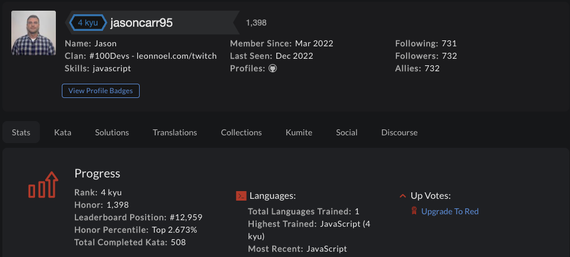

# CodeWars Challenges: <a target="_blank" href="https://www.codewars.com/users/jasoncarr95" >Visit Here</a>

A repository filled with codewars challenges (kata).
As of 10/9/2022: 445 challenges solved, ranked in top 3.67% percentile

## How It's Made

**Tech used:** 

I try to do a coding challenge every day to stay sharp and level up my problem solving skills. I started solving challenges on codewars.com, which are the challenges contained in this repo, but I also will do leetcode or other challenges from different sources.

## Optimizations

Ideally this repo would be much better organized.

Initially I would create a single new js file each day and add all the challenges I completed on a given day to said file. Somewhat recently I  started creating a new directory for each day, with separate files for each individual challenge - Even more recently I started grouping by type of challenges solved (array/string/etc.)

In an ideal world I'd spend the time to go back and reorganize the past problems better, splitting each challenge into its own file. It would also be nice to be able to group/sort by KYU level.

## Lessons Learned

There are many different ways to solve one problem.

It can helpful to look at other top submissions - however sometimes they can be too code-golfy to actually be optimal... it's better to write a few extra lines of code to make it easily readable by humans.

Take time before jumping in to solve a problem. Think through potential edge-cases, and keep space & time complexity in mind.

Not being able to answer a question is okay, as long as you take the initiative to improve! Some questions can be practically impossible to solve your first time if you've never seen a similar problem before.

There is a long way to go, and always more to learn!
